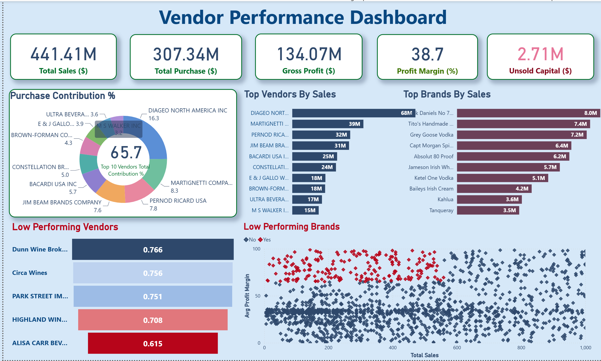
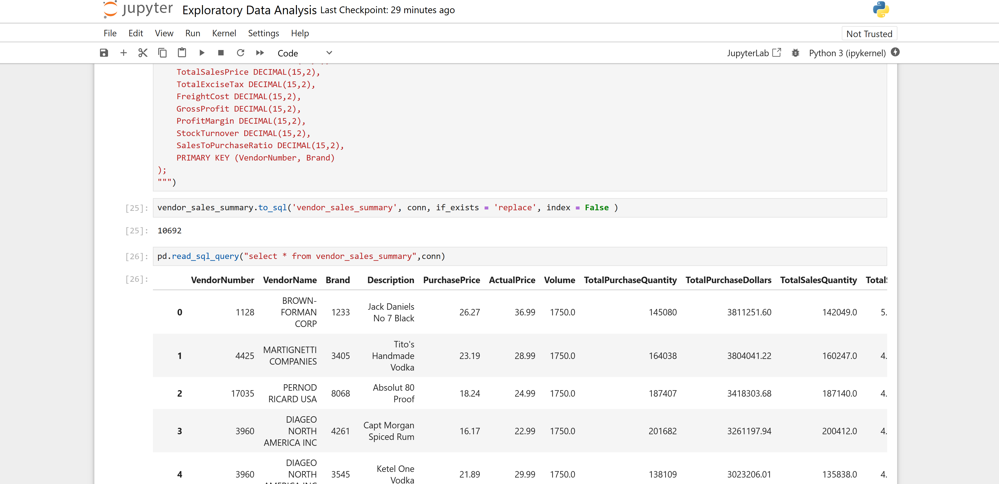
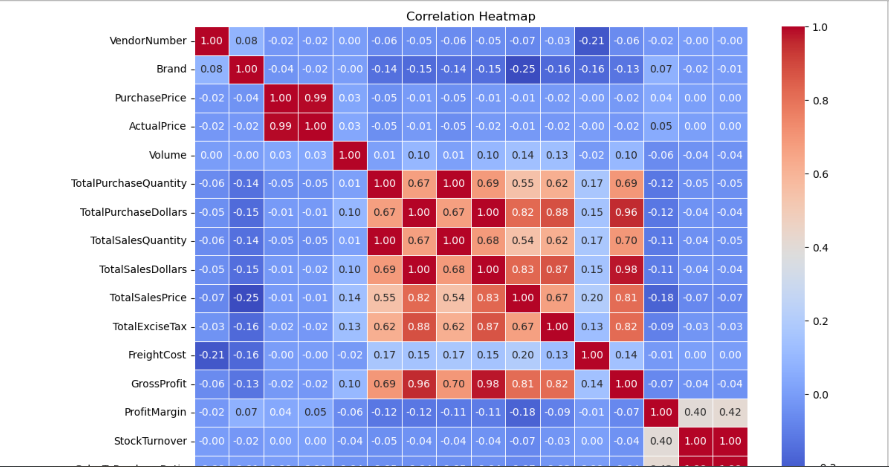
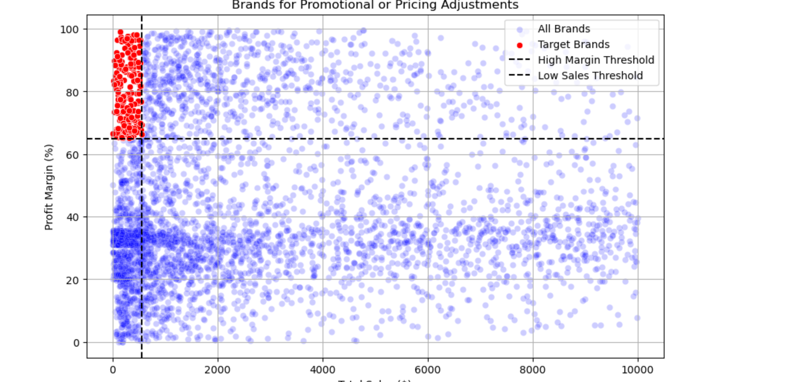
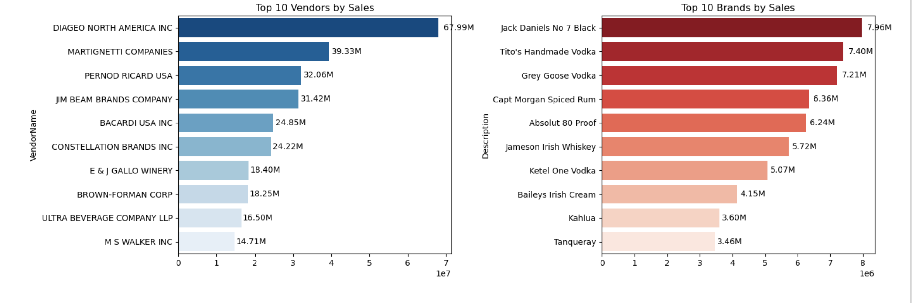
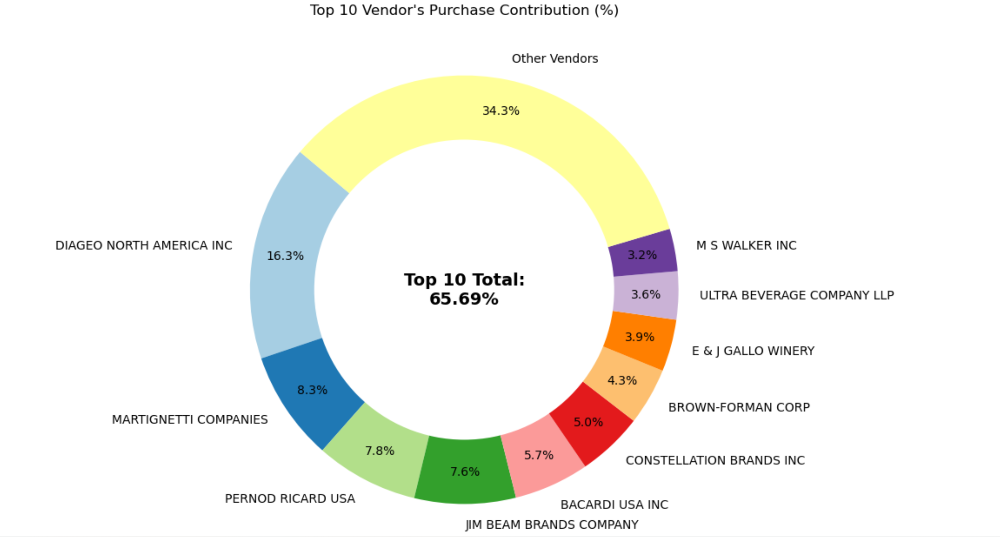

# Vendor Performance Analysis

An end-to-end data analysis project examining vendor and inventory performance for a retail/wholesale business — covering data ingestion, SQL-based aggregation, exploratory data analysis in Python, and an interactive Power BI dashboard.

## Business Problem

Effective inventory and sales management is critical for profitability in retail and wholesale. This project analyzes vendor and inventory data to:
- Identify underperforming brands that need promotional or pricing adjustments
- Determine which vendors contribute most to sales and gross profit
- Quantify the impact of bulk purchasing on unit costs
- Assess inventory turnover to flag holding-cost risk
- Compare profitability between high- and low-performing vendors

## Tech Stack

- **Python** (pandas, SQLAlchemy) — data ingestion and cleaning
- **SQLite** — local database for querying and joins
- **Jupyter Notebook** — exploratory data analysis and statistical testing
- **Power BI** — interactive dashboard and reporting

## Project Structure

```
Vendor_Market_Analysis/
├── data/                              # raw CSV source files
│   ├── begin_inventory.csv
│   ├── end_inventory.csv
│   ├── purchases.csv
│   ├── purchase_prices.csv
│   ├── sales.csv
│   └── vendor_invoice.csv
├── ingestion_db.py                    # loads raw CSVs into SQLite (inventory.db)
├── get_vendor_summary.py              # builds the cleaned vendor_sales_summary table via SQL
├── Exploratory Data Analysis.ipynb    # initial EDA, distributions, outlier checks
├── Vendor Performance Analysis.ipynb  # correlation analysis, hypothesis testing, insights
├── vendor_sales_summary.csv           # exported summary table
├── vendor_performance.pbix            # Power BI dashboard
└── Vendor Performance Report.pdf      # final written report
```

## How to Run

1. Clone the repo and install dependencies:
```bash
   git clone https://github.com/<your-username>/vendor-performance-analysis.git
   cd vendor-performance-analysis
   pip install pandas sqlalchemy jupyter matplotlib seaborn scipy
   mkdir logs
```
2. Ingest the raw data into SQLite:
```bash
   python ingestion_db.py
```
3. Build the vendor summary table:
```bash
   python get_vendor_summary.py
```
4. Open and run the notebooks in order:
   - `Exploratory Data Analysis.ipynb`
   - `Vendor Performance Analysis.ipynb`
5. Open `vendor_performance.pbix` in Power BI Desktop to explore the dashboard.

## Screenshots

**Power BI Dashboard**


**Exploratory Data Analysis (Jupyter)**


**Vendor Performance Analysis (Jupyter)**






## Key Findings

- **Vendor concentration:** the top 10 vendors account for 65.69% of total purchases, leaving the business exposed to supply-chain risk from over-reliance on a small vendor base.
- **Bulk purchasing:** buying in bulk lowers unit cost by ~72% ($10.78/unit vs. higher costs on smaller orders).
- **Slow-moving inventory:** $2.71M in unsold inventory capital identified, flagging vendors with poor turnover.
- **Margin vs. volume trade-off:** low-performing vendors have higher average profit margins (41.55%) than top vendors (31.17%), but far lower sales volume — a statistically significant difference (hypothesis test rejects H₀).
- **198 brands** show low sales but high margins — candidates for promotional or pricing adjustments to grow volume without hurting profitability.

## Recommendations

- Re-price low-sales, high-margin brands to drive volume.
- Diversify vendor relationships to reduce supply-chain risk.
- Expand bulk-purchasing agreements to lock in cost savings.
- Clear slow-moving inventory through adjusted ordering and clearance strategies.
- Strengthen marketing/distribution support for low-performing vendors.

